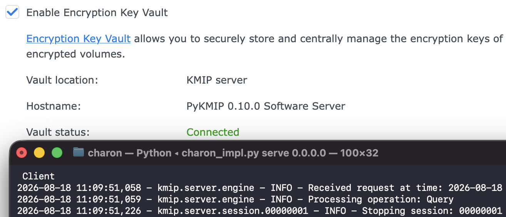

# Charon



Charon is a small, portable KMIP server for Synology DSM, built with Bash, Python, and PyKMIP.
Its Python virtual environment is disposable and kept separate from the persistent certificates and KMIP state.

The idea is to keep it handy and run in foreground on-demand, as opposed to an always-on service.

### Disclaimer

This is a proof of concept intended to demonstrate portable KMIP integration with Synology DSM. It has not undergone extensive testing or audit.

Do not rely on this as the only means of accessing encrypted data. Keep verified recovery keys and backups of the certificate and KMIP state directories. Review the implementation and use it at your own risk.

### Usage
Run `./charon.sh` to view the available commands.

### Troubleshooting

If DSM reports that it cannot connect, SSH into the Synology NAS as an
administrator, become root (`sudo -i`), and follow the complete system journal:

```bash
journalctl -xef
```

Leave the command running while reproducing the failure in Control Panel.

### Credit
Based on [kmip-server-dsm](https://github.com/rnurgaliyev/kmip-server-dsm/tree/master) by rnurgaliyev.
